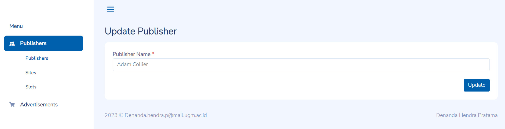
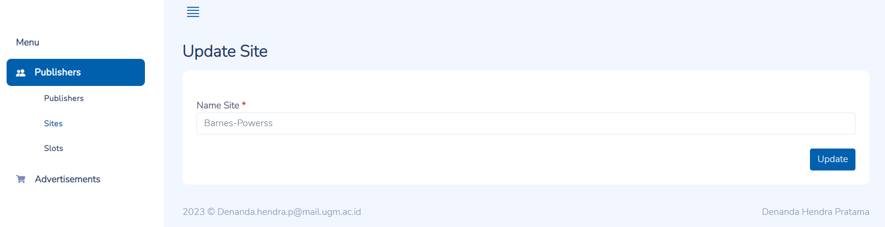

#### DENANDA HENDRA PRATAMA

#### denanda.hendra.p@mail.ugm.ac.id

#### How to run locally:

##### 1. Install dependencies

1. clone the repository.

   ```
   https://github.com/denandahp/adbro_test.git
   ```
2. Create a [python virtual environment and activate it](https://docs.python.org/3/library/venv.html)
3. Install dependencies:

   ```
   pip install -r requirements.txt
   ```
4. Migrate the app to create database table

   ```
   python manage.py migrate
   ```

##### 2. Launch the apps

1. Run the server locally

   ```
   python manage.py runserver
   ```
2. After the apps running is succesfully, we can start by calling routes. For example :

   ```
   http://127.0.0.1:8000/
   ```


##### 3. Documentation

###### Generate dummy data

1. Generate dummy data of `publisher`, `site `and `slot`

   ```
   python manage.py generate_slots
   ```
2. Generate dummy data of `Advertiser`, `Campaign`, `AdvertisementGroup`, `AdvertisementGroupTargetingRule`, `Advertisement` and `DenormalizedAdvertisement`.

   Before generating advertisement data, you must first generate data from generate_slots so there are no errors.

   ```
   python manage.py generate_advertisements
   ```

###### **Path** for dashboard publihsers

| Path                                                   | Description                                          |
| ------------------------------------------------------ | ---------------------------------------------------- |
| /dashboards/publishers/index/publishers                | To display a list of publishers                      |
| /dashboards/publishers/index/sites                     | To display a list of sites                           |
| /dashboards/publishers/index/slots                     | To display a list of slots                           |
| /dashboards/publishers/add/publishers                  | To create a new publisher along with sites and slots |
| /dashboards/publishers/add/slot/:uuid_publisher        | To create new slot with existing publisher and site  |
| /dashboards/publishers/add/site/:uuid_publisher        | To create new site with existing publisher           |
| /dashboards/publishers/edit/publishers/:uuid_publisher | To update publisher name                             |
| /dashboards/publishers/edit/slot/:uuid_slot            | To update slot name                                  |
| /dashboards/publishers/edit/site/:uuid_site            | To update site name                                  |

###### **Path** for dashboard advertisemenets dashboards/advertisements/

| Path                          | Description                                                                  |
| ----------------------------- | ---------------------------------------------------------------------------- |
| dashboards/advertisements/    | To display a list of advertisements base on DenormalizedAdvertisement model |
| dashboards/advertisements/add | To create new advertisements and DenormalizedAdvertisement                   |

###### Explanation of paths

1. Dashboard Publihsers

   * Create a new publisher
     * Access URL : 127.0.0.1:8000/dashboards/publishers/add/publishers
     * Fields:

   | Field          | Type   | Description       |
   | -------------- | ------ | ----------------- |
   | Publisher Name | String | Name of publisher |
   | Site Name      | String | Name of site      |
   | Slot Name      | String | Name of slot      |

   


   * Create new site

     * Access URL : 127.0.0.1:8000/dashboards/dashboards/publishers/add/slot/:uuid_publisher
     * Parameter:
       * uuid_publisher: uuid from publisher, type string
     * Fields:

     | Field          | Type   | Description                   |
     | -------------- | ------ | ----------------------------- |
     | Name Publisher | Object | List of registered publishers |
     | Name Site      | string | Name of site                  |

     
   * Create new slot

     * Access URL : 127.0.0.1:8000/dashboards/publishers/add/site/:uuid_publisher
     * Parameter:
       * uuid_publisher: uuid from publisher, type string
     * Fields:

     | Field     | Type           | Description                                              |
     | --------- | -------------- | -------------------------------------------------------- |
     | Name Slot | string         | Name of slot                                             |
     | Name Site | Lisf of Object | List of sites that have been registered with a publisher |

     
   * Update publisher name

     * Access URL : 127.0.0.1:8000/dashboards/publishers/edit/publishers/:uuid_publisher
     * Parameter:
       * uuid_publisher: uuid from publisher, type string
     * Fields:

     | Field          | Type   | Description       |
     | -------------- | ------ | ----------------- |
     | Publisher Name | String | Name of publisher |

     
   * Update site name

     * Access URL : 127.0.0.1:8000/dashboards/publishers/edit/site/:uuid_site
     * Parameter:
       * uuid_site: uuid from site, type string
     * Fields:

     | Field     | Type   | Description  |
     | --------- | ------ | ------------ |
     | Name Site | String | Name of site |

     
   * Update slot name

     * Access URL : 127.0.0.1:8000/dashboards/publishers/edit/slot/:uuid_slot
     * Parameter:
       * uuid_slot: uuid from slot, type string
     * Fields:

     | Field     | Type   | Description  |
     | --------- | ------ | ------------ |
     | Name Slot | String | Name of slot |

     
2. Dashboard Advertisemenets

   * Create new advertisements and DenormalizedAdvertisement

     * Access URL : 127.0.0.1:8000/dashboards/advertisements/add
     * Fields:

     | Field               | Type           | Description                     |
     | ------------------- | -------------- | ------------------------------- |
     | Name Advertiser     | String         | Name of advertiser              |
     | Name Campaign       | String         | Name of campaign                |
     | Advertisement       | String         | Data of advertisement           |
     | Advertisement Group | String         | Name of Advertisement Group    |
     | Tags                | String         | Tags for targeting rule         |
     | Description         | String         | Description for targeting rule |
     | Name Publisher      | Lisf of Object | List of registered publishers   |

     
